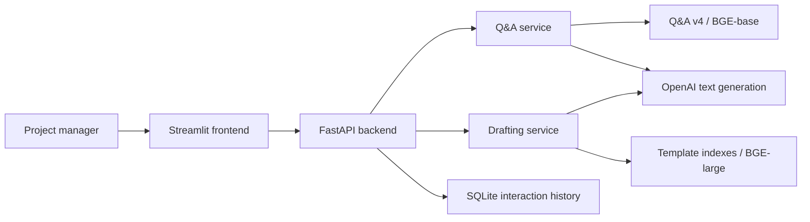

# EPLC AI Assistant

EPLC AI Assistant is a prototype created for the Columbia University QMSS
Practicum in partnership with IBM. It explores how retrieval-augmented
generation (RAG) can help project managers navigate Enterprise Performance Life
Cycle guidance and draft EPLC deliverables.

The prototype focuses on four phases:

- Requirements Analysis
- Design
- Development
- Implementation

## Current status

The repository now has a small but complete application workflow:

- A Streamlit frontend for policy Q&A and section-by-section drafting
- A FastAPI backend with validated request and response contracts
- Reusable Q&A, drafting, retrieval, and LLM service layers
- Chroma vector indexes for retrieval and SQLite for interaction history
- Unit, integration, API, persistence, and retrieval evaluation tests
- Docker Compose and GitHub Actions configuration

The original scripts under `Coding/` remain available as traceable experiments;
the application code under `src/eplc_assistant/` is the supported runtime.

## Architecture



The frontend does not import retrieval or model code. It communicates with the
backend over HTTP, while the backend composes the existing domain services.
This keeps UI, transport, business logic, model adapters, and persistence
separately testable.

## Intended workflow

1. Parse and chunk official EPLC guidance and templates.
2. Embed the chunks and store them in ChromaDB.
3. Retrieve relevant chunks for a project manager's question or selected
   document section.
4. Ask an OpenAI model to answer or draft using the retrieved context.
5. Show the supporting sources and flag information that still needs human
   confirmation.

AI-generated content is a drafting aid. It is not an official compliance
determination and should be reviewed by the responsible project team.

## Local setup

Python 3.10 or newer is recommended.

```bash
python -m venv .venv
source .venv/bin/activate
pip install -e .
cp .env.example .env
```

Add an OpenAI API key to `.env`. Start the backend in one terminal:

```bash
make api
```

Then start the frontend in another terminal:

```bash
make ui
```

Open `http://localhost:8501`. API documentation is available at
`http://localhost:8000/docs`.

The same two-process setup can be started with:

```bash
docker compose up --build
```

The Q&A runtime uses the evaluated v4 BGE-base index. Drafting uses the
pre-existing BGE-large template indexes. The models are configured separately
because vectors from different embedding models are not interchangeable.

## API

| Method | Endpoint | Purpose |
|---|---|---|
| `GET` | `/health` | Lightweight liveness check |
| `GET` | `/ready` | Configuration, index, and state-database readiness |
| `POST` | `/api/v1/qna` | Grounded EPLC question answering |
| `POST` | `/api/v1/drafts` | Grounded document-section drafting |
| `GET` | `/api/v1/interactions` | Local interaction history |
| `GET` | `/api/v1/interactions/{id}` | One persisted interaction |

Request history is stored locally in `var/eplc_assistant.sqlite3`. Do not enter
sensitive project information in an unapproved deployment.

## Tests and retrieval evaluation

Run the automated suite:

```bash
make test
```

Rebuild and evaluate the Q&A index:

```bash
python "Coding/Q&A/qna_data_pipeline.py" prepare
python "Coding/Q&A/qna_data_pipeline.py" build
python "Coding/Q&A/evaluate_retrieval.py" \
  --index "Data/Vector DataBase/qna_v4_bge_base_en_v1_5" \
  --model "BAAI/bge-base-en-v1.5"
```

GitHub Actions runs compilation and the complete test suite for pushes and pull
requests.

## Repository guide

- `Coding/`: original Q&A and document-generation experiments
- `Data/`: source documents, processed JSON, embeddings, and Chroma artifacts
- `src/eplc_assistant/`: reusable application, RAG, and service code
- `tests/`: unit, integration, API, client, storage, and data-pipeline tests
- `evaluation/`: checked-in retrieval questions and model-comparison reports
- `Weekly Report/`: historical practicum presentation material

## Production gaps

This is an industry-structured prototype, not an approved production system.
Before handling real organizational data it still needs identity and access
management, encrypted managed storage, secrets management, rate limiting,
centralized monitoring, formal security review, and a governed deployment
environment.

## Data sources

The data preparation notes and source links are documented in
[`Data/README.md`](Data/README.md).


